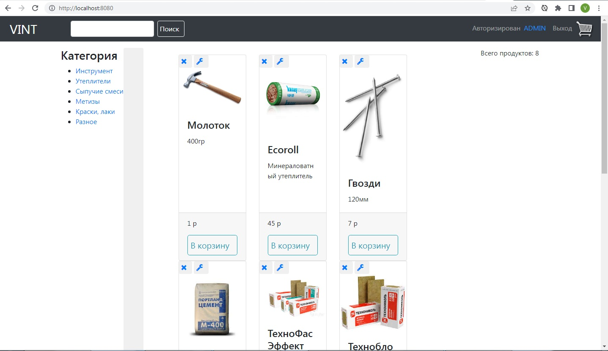

## Description

This is my first project using Spring. I wanted to do e-commerce web application to learn Spring. I have used **Spring Boot**, **Spring Security**, **Spring Data JPA** with **H2 database**, for views i have used **Thymeleaf** template and **Bootstrap** CSS framework.

## Screenshots




## Installation

You can clone this repository and use it localy:
```sh
$ git clone https://github.com/Vitaly2022/shop
```

**Using Maven plugin**

First you should do clean installation:
```sh
$ mvn clean install
```
You can start application using Spring Boot custom command:
```sh
$ mvn spring-boot:run
```

**Using Maven plugin and running JAR**

You can create JAR file using:
```sh
$ mvn clean package
```
and then run it with:
```sh
$ java -jar target/*jar
```

## Logins

ADMIN role is assigned by MySql query.

The USER role is given to all registered.

## Roles

**ADMIN** In personal account, can add, edit and delete site content (product, category, manufacturer, order, review, supplier, user).

**USER** can add, edit and delete products in cart. Send cart to order. In personal account see your orders and their status. Edit profile.

## Tests

You can run tests using:
```sh
$ mvn test
```
